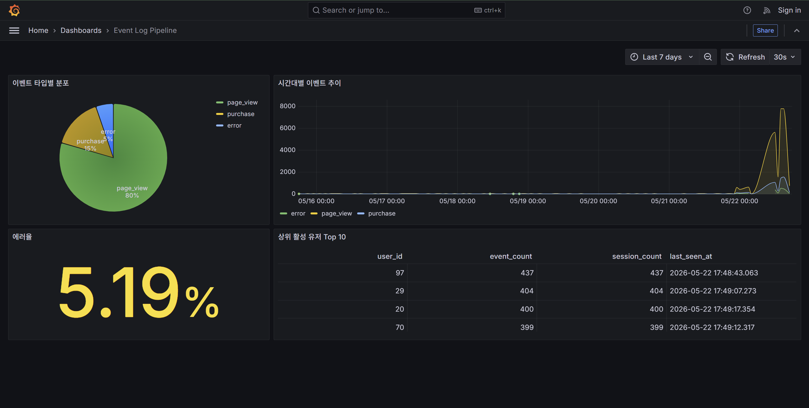

# Event Log Pipeline

> 웹 서비스의 이벤트 로그를 생성하고, 저장하고, 분석하고, 시각화하는
> 미니 데이터 파이프라인.

`docker compose up` 한 번으로 이벤트 생성기, PostgreSQL, Grafana가 함께 실행된다.

---

## 기술 스택

- **Python** — 이벤트 생성기
- **PostgreSQL** — 이벤트 저장
- **Grafana** — 분석 결과 시각화
- **Docker Compose** — 전체 스택 오케스트레이션

---

## 프로젝트 구조

```
event-log-pipeline/
├── README.md
├── docker-compose.yml
├── .env.example
├── pytest.ini
├── requirements-dev.txt
├── generator/                  # 이벤트 생성기 (Python)
│   ├── Dockerfile
│   ├── main.py                 # 시드 + 스트림 진입점
│   ├── events.py               # generate_event / pick_event_type
│   ├── db.py                   # PostgreSQL 적재 (batch + retry)
│   └── requirements.txt
├── db/
│   ├── init/                   # docker-entrypoint-initdb.d 자동 실행
│   │   └── 01_schema.sql
│   └── queries/                # 분석 쿼리 4개
├── grafana/
│   └── provisioning/           # 데이터소스 + 대시보드 자동 로딩
├── docs/
│   ├── aws-design.md           # AWS 아키텍처 설계
│   ├── k8s-design.md           # K8s 운영 매핑 (참고)
│   └── grafana-dashboard.png   # 대시보드 스크린샷
└── tests/
    ├── test_events.py          # 단위 테스트 6개
    └── test_integration.py     # 통합 테스트 (testcontainers) 5개
```

---

## 실행 방법

### 사전 요구사항
- Docker 20+
- Docker Compose v2

### 실행

```bash
cp .env.example .env             # 환경변수 파일 준비 (필요 시 값 수정)
docker compose up --build -d     # 이미지 빌드 + 백그라운드 실행
```

`postgres` healthcheck 통과 후 `generator` 가 자동으로 시작된다.

### 상태 확인

```bash
docker compose ps                       # 컨테이너 상태
docker compose logs -f generator        # 생성기 실시간 로그
```

### 적재 데이터 확인

```bash
docker compose exec postgres psql -U eventuser -d eventdb \
  -c "SELECT event_type, COUNT(*) FROM events GROUP BY event_type ORDER BY event_type;"
```

### Grafana 대시보드 접속

브라우저에서 `http://localhost:3000` 접속 — 익명 Viewer 로 로그인 없이 바로 확인.
자세한 패널 구성과 스크린샷은 아래 "시각화" 섹션 참조.

### 정리

```bash
docker compose down -v   # 볼륨까지 삭제 (다음 기동 시 스키마 다시 적용됨)
```

---

## 이벤트 스키마

모든 이벤트는 단일 `events` 테이블에 저장한다. 공통 필드는 컬럼으로 분리하고, 이벤트 타입에 따라 달라지는 가변 필드만 `properties` 컬럼(JSONB)에 담는다.

### 테이블 구조

| 컬럼 | 타입 | 설명 |
|------|------|------|
| `event_id` | `UUID` | 이벤트 고유 식별자 |
| `event_type` | `VARCHAR(32)` | `page_view` / `purchase` / `error` |
| `user_id` | `INT` | 이벤트를 발생시킨 사용자 |
| `session_id` | `VARCHAR(64)` | 사용자 세션 식별자 |
| `created_at` | `TIMESTAMPTZ` | 이벤트 발생 시각 (UTC) |
| `ip_address` | `INET` | 클라이언트 IP |
| `user_agent` | `TEXT` | 브라우저/디바이스 정보 |
| `properties` | `JSONB` | 이벤트 타입별 가변 필드 |

### 이벤트 타입별 `properties` 예시

| 타입 | `properties` |
|------|--------------|
| `page_view` | `{"path": "/products/42", "referrer": "/home"}` |
| `purchase`  | `{"product_id": "P-001", "amount": 29900, "currency": "KRW"}` |
| `error`     | `{"error_code": "500", "message": "Internal Server Error", "path": "/api/orders"}` |

### 설계 이유

JSON을 통째로 저장하면 분석마다 JSONB 파싱이 필요하고, 이벤트 타입별로 테이블을 분리하면 통합 분석마다 UNION이 필요하다. 공통 컬럼은 분리하여 인덱스로 빠르게 집계하고, 타입별로 다른 부분만 JSONB로 두는 절충안을 선택했다.

---

## 분석 쿼리

분포 · 추이 · 품질 · 사용자 4가지 관점을 한 번에 보기 위해 다음 4개 쿼리를 정의했다.
전체 SQL은 `db/queries/` 에 있고, Grafana 대시보드 4개 패널과 1:1 매핑된다.

### 실행 방법

```bash
# 단일 쿼리
docker compose exec -T postgres psql -U eventuser -d eventdb \
  < db/queries/01_events_by_type.sql

# 전체 일괄 실행
for f in db/queries/*.sql; do
  echo "==================== $f ===================="
  docker compose exec -T postgres psql -U eventuser -d eventdb < "$f"
done
```

> 일괄 실행 스크립트는 Linux/macOS 기준. Windows에서는 PowerShell 또는 WSL 사용 권장.

---

### 1. 이벤트 타입별 발생 횟수 + 비율

데이터 분포가 의도한 비율(80/15/5)로 들어왔는지 확인.

```sql
-- db/queries/01_events_by_type.sql
SELECT
    event_type,
    COUNT(*)                                                AS event_count,
    ROUND(100.0 * COUNT(*) / SUM(COUNT(*)) OVER (), 2)      AS percentage
FROM events
GROUP BY event_type
ORDER BY event_count DESC;
```

```
 event_type | event_count | percentage
------------+-------------+------------
 page_view  |       13678 |      80.53
 purchase   |        2492 |      14.67
 error      |         816 |       4.80
```

→ 의도한 80/15/5 분포에 잘 부합한다.

---

### 2. 시간대별 이벤트 추이 (최근 7일, 시간 단위)

시계열 패턴 파악 — Grafana time series 패널의 입력 쿼리로 사용된다.

```sql
-- db/queries/02_hourly_trend.sql
SELECT
    date_trunc('hour', created_at)  AS hour,
    event_type,
    COUNT(*)                        AS event_count
FROM events
WHERE created_at >= NOW() - INTERVAL '7 days'
GROUP BY hour, event_type
ORDER BY hour DESC, event_type;
```

결과 (최근 10행 발췌):

```
          hour          | event_type | event_count
------------------------+------------+-------------
 2026-05-21 03:00:00+00 | error      |         169
 2026-05-21 03:00:00+00 | page_view  |        2601
 2026-05-21 03:00:00+00 | purchase   |         496
 2026-05-20 19:00:00+00 | page_view  |          10
 2026-05-20 19:00:00+00 | purchase   |           3
 2026-05-20 18:00:00+00 | error      |         142
 2026-05-20 18:00:00+00 | page_view  |        2245
 2026-05-20 18:00:00+00 | purchase   |         420
 2026-05-20 15:00:00+00 | error      |          42
 2026-05-20 15:00:00+00 | page_view  |         667
```

---

### 3. 에러율 (서비스 안정성 KPI)

전체 이벤트 대비 error 비율 — 단일 숫자(KPI 카드용).

```sql
-- db/queries/03_error_ratio.sql
WITH stats AS (
    SELECT
        COUNT(*) FILTER (WHERE event_type = 'error') AS error_count,
        COUNT(*)                                     AS total_count
    FROM events
)
SELECT
    error_count,
    total_count,
    ROUND(100.0 * error_count / NULLIF(total_count, 0), 2) AS error_rate_percentage
FROM stats;
```

```
 error_count | total_count | error_rate_percentage
-------------+-------------+-----------------------
         800 |       16593 |                  4.82
```

→ 의도한 5% 가중치에 근사 (이벤트 생성기 동작 검증).

---

### 4. 상위 활성 유저 Top 10

단순 이벤트 수만 보면 패턴 구분이 어렵기에 **세션 수 / 최근성**까지 함께 본다.

```sql
-- db/queries/04_top_active_users.sql
SELECT
    user_id,
    COUNT(*)                       AS event_count,
    COUNT(DISTINCT session_id)     AS session_count,
    MAX(created_at)                AS last_seen_at
FROM events
GROUP BY user_id
ORDER BY event_count DESC
LIMIT 10;
```

```
 user_id | event_count | session_count |         last_seen_at
---------+-------------+---------------+-------------------------------
      69 |         194 |           194 | 2026-05-21 03:55:50.381037+00
      49 |         192 |           192 | 2026-05-21 03:55:24.199099+00
      27 |         189 |           189 | 2026-05-21 03:55:28.23242+00
      58 |         188 |           188 | 2026-05-21 03:55:25.207868+00
      72 |         186 |           186 | 2026-05-21 03:55:44.347619+00
      91 |         185 |           185 | 2026-05-21 03:55:16.137428+00
      10 |         184 |           184 | 2026-05-21 03:55:21.174338+00
      17 |         183 |           183 | 2026-05-21 03:55:43.339946+00
       5 |         183 |           183 | 2026-05-21 03:55:18.153335+00
      21 |         182 |           182 | 2026-05-21 03:55:44.347152+00
```

→ `event_count == session_count` 인 것은 현재 생성기가 매 이벤트마다 새 `session_id` 를 발급하기 때문(단순성 우선). 세션 유지 모델은 향후 개선 항목.

---

## 시각화

`docker compose up` 직후 Grafana 가 데이터소스와 대시보드를 자동 로딩한다 (provisioning 기반).

### 접속

- URL: `http://localhost:3000`
- 익명 접속 (Viewer 권한) — 로그인 불필요
- 관리자 계정: `admin / admin` (`.env` 에서 변경 가능)

### 대시보드 미리보기



### 패널 구성

| # | 패널 | 시각화 | 데이터 |
|---|------|--------|--------|
| 1 | 이벤트 타입별 분포 | Pie chart | `page_view` / `purchase` / `error` 비율 |
| 2 | 시간대별 이벤트 추이 | Time series | 시간 단위 발생량 (멀티 시리즈) |
| 3 | 에러율 | Stat | 단일 숫자, 5/10% threshold 컬러 |
| 4 | 상위 활성 유저 Top 10 | Table | `event_count` / `session_count` / `last_seen_at` |

- **자동 새로고침**: 30초
- **기본 time range**: 최근 7일 (우측 상단에서 변경 가능)
- **`$__timeFilter` 매크로**: Time series 패널은 대시보드 time picker 와 자동 연동

### 설계 의도

- **provisioning 자동화**: 데이터소스/대시보드를 yaml + JSON 으로 git 관리. 컨테이너 재배포 시에도 동일 상태 복원
- **분석 쿼리와 1:1 매핑**: 각 패널 SQL 은 `db/queries/` 의 4개 쿼리와 동일 구조 — 시각화 결과가 곧 SQL 결과
- **익명 접속**: 평가/공유 친화. 권한은 Viewer 로 제한 → 데이터 수정/삭제 불가

---

## AWS 설계 (선택 과제 B)

본 파이프라인을 AWS 운영 환경으로 옮긴다면 어떻게 설계할지에 대한 답안.

### 핵심 매핑

| 현재 | AWS |
|------|-----|
| `generator` 컨테이너 | ECS Fargate |
| (이벤트 버퍼) | Kinesis Data Streams |
| (적재 컨슈머) | Lambda 또는 ECS Fargate Consumer |
| `postgres` 컨테이너 | RDS PostgreSQL (Multi-AZ) |
| (장기 보관) | S3 + Kinesis Firehose |
| `grafana` 컨테이너 | Amazon Managed Grafana |
| (없음) | CloudWatch + SNS, Secrets Manager |

### 핵심 변경 포인트
- 생성기-DB 사이에 **메시지 큐 (Kinesis Data Streams)** 도입 → 디커플링 / 버퍼링 / 재처리
- **Managed 서비스** 우선 사용 → 운영 부담 최소화
- CloudWatch + SNS 로 모니터링/알림 자동화

> 상세 설계 · 데이터 플로우 · 대안 분석 · 비용은 [`docs/aws-design.md`](docs/aws-design.md) 참조.

### 참고: Kubernetes 운영 매핑 아이디어

선택 과제는 AWS 로 충족했다. K8s 는 manifest 작성 없이 운영 시 어떻게 매핑할지 [`docs/k8s-design.md`](docs/k8s-design.md) 에 참고용 설계 메모로 정리했다.

| 컴포넌트 | K8s 리소스 |
|----------|-----------|
| generator | Deployment |
| postgres | StatefulSet + PVC |
| grafana | Deployment + PVC |
| 환경변수 / 비밀번호 | ConfigMap / Secret 분리 |

---

## 테스트

테스트는 책임을 둘로 분리했다.

### 단위 테스트 — `tests/test_events.py`

외부 의존성 없는 순수 로직(이벤트 생성 / 타입별 properties / 가중치 분포) 검증.

```bash
pytest tests/test_events.py -v
```

### 통합 테스트 — `tests/test_integration.py`

`testcontainers` 로 실 PostgreSQL 컨테이너를 자동으로 띄워 스키마 → 적재 → 집계까지 end-to-end 검증.
mock 대신 실 DB 를 쓰는 이유: SQL 제약 / JSONB / 트랜잭션 같은 DB-side 동작은 mock 으로 검증하면 prod 와 divergence 위험이 있다.

```bash
pip install -r requirements-dev.txt   # testcontainers 설치
pytest tests/test_integration.py -v
```

- 첫 실행 시 `postgres:16-alpine` 이미지 pull (~30초)
- 이후 실행 ~10초

### 검증 범위

| 종류 | 검증 |
|------|------|
| 단위 | 필수 필드 / 타입별 properties / 가중치 분포(10,000건) |
| 통합 | 단일 INSERT / batch 1000건 / JSONB round-trip / 5000건 분포 / CHECK 위반 시 롤백 |

---

## 구현하면서 고민한 점

### 1. 스키마 설계 — 단일 테이블 + JSONB 절충 (옵션 C)

세 가지 방향을 두고 고민했다.
- **A: 전부 JSONB** — 단순하지만 분석마다 JSONB 파싱 필요 → 과제 의도(필드 분리)와 어긋남
- **B: 이벤트 타입별 테이블** — 통합 분석마다 UNION, 새 타입 추가 시 테이블 신설 → 과도한 정규화
- **C: 공통 컬럼 분리 + 가변 필드만 JSONB** — 인덱스 효율 + 유연성. **채택**

### 2. 이벤트 생성 — 시드 + 스트림 이중 단계

평가자가 `docker compose up` 직후 보게 될 화면을 우선 고려했다.
- **시드만 있으면** 정적 (실시간성 X)
- **스트림만 있으면** 처음 몇 분간 차트 비어 있음
- **둘 다 → 풍부한 7일치 데이터 + 실시간 흐름** 동시 제공

80/15/5 가중치는 균등 분포의 비현실성을 피하고 "에러율 5%", "전환율 ~18%" 같은 의미 있는 분석을 가능하게 했다.

### 3. `docker compose up` 한 번으로 모든 게 동작

평가자 동선을 최소화하는 데 집중했다.
- **PostgreSQL 자동 스키마 초기화** (`docker-entrypoint-initdb.d`)
- **Generator 자동 시드 + 스트림** (`depends_on: service_healthy`)
- **Grafana provisioning** — 데이터소스 + 대시보드 모두 yaml/json 자동 로딩
- **익명 Viewer 접속** — 로그인 절차 없이 즉시 대시보드 확인

결과: `docker compose up -d` → `http://localhost:3000` 한 줄로 데이터 + 분석 + 시각화 모두 동작.

### 4. 현재는 단순 직결, AWS 는 메시지 큐 도입

본 과제 규모(시드 5,000 + 스트림 2~5 RPS)에서는 generator → DB 직결로 충분.
하지만 운영 환경을 가정하면 단일 머신/직결 구조는:
- DB 장애가 generator 로 즉시 전파
- 멀티 컨슈머/리플레이 불가능
- 백프레셔 처리 못함

AWS 설계에서는 **Kinesis Data Streams** 를 디커플링 계층으로 두고, hot path (RDS) + cold path (S3) 를 분리했다 (`docs/aws-design.md`).

### 5. 의도적 단순화 — 세션 모델

매 이벤트마다 새 `session_id` 를 발급한다. 실제 서비스라면 사용자가 머무는 동안 같은 세션을 유지해야 한다.
- 본 과제 분석 쿼리는 세션 유지 모델 없이도 충분한 의미 전달 가능
- 상태 관리 도입은 복잡도 vs 가치 균형에서 단순화 선택
- 시간 더 있으면 개선할 1순위 항목

→ **모든 단순화는 의도된 것** — 모르는 게 아니라 트레이드오프 결과.
