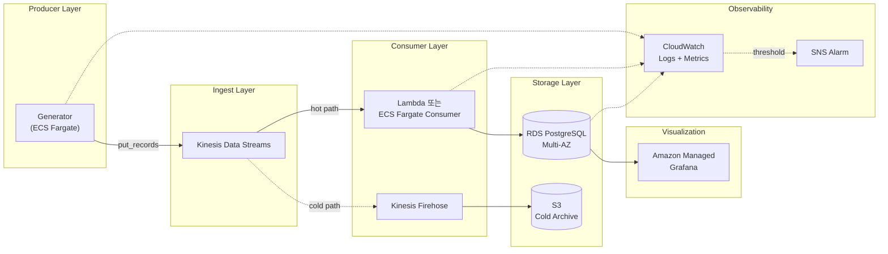

# AWS 아키텍처 설계 (선택 과제 B)

> 본 문서는 현재 docker-compose 기반 미니 파이프라인을 **AWS 운영 환경**으로 옮긴다고 가정했을 때의 설계안.

---

## 1. 개요

### 현재 구조의 한계
- 단일 머신에서 모든 컴포넌트 실행 → SPOF
- 생성기와 DB 가 직접 결합 → DB 장애가 생성기로 즉시 전파
- 모니터링/알림 부재
- 데이터 백업 책임이 사용자에게

### AWS 운영 시 핵심 변경점
- 생성기-DB 사이에 **메시지 큐(Kinesis)** 도입 → 디커플링 / 버퍼링 / 재처리
- **Hot path / Cold path 분리** (Lambda Architecture) — RDS(실시간 분석) + S3(장기 보관)
- **Managed 서비스** 우선 사용 → 운영 부담 최소화
- 모니터링/알림 자동화 (CloudWatch + SNS)

---

## 2. 아키텍처 다이어그램

---

## 3. 데이터 플로우

1. **Generator (ECS Fargate task)**: 매초 2~5건 이벤트 생성, Kinesis Data Streams 에 `put_records` 호출
2. **Kinesis Data Streams**: 이벤트 버퍼 (보존 24시간~7일), shard 단위 처리량 보장
3. **Hot path — Lambda 또는 ECS Fargate Consumer**: 스트림을 읽어 RDS PostgreSQL 에 배치 적재 (실시간 분석용)
4. **Cold path — Kinesis Firehose**: 같은 스트림을 구독해 S3 로 보관 (장기 보관 + Athena 분석)
5. **RDS PostgreSQL**: hot data 저장 (현재 `events` 테이블 스키마 그대로)
6. **Managed Grafana**: RDS 를 데이터소스로 → 현재 4 패널 대시보드 그대로 사용

> **왜 Firehose 가 RDS 로 직접 가지 않는가**: Amazon Data Firehose 의 공식 전달 대상은 S3 / Redshift / OpenSearch / Splunk / HTTP endpoint 등이며, RDS PostgreSQL 은 Firehose 의 직접 destination 으로 지원되지 않는다. 따라서 RDS 적재는 별도 컨슈머(Lambda 또는 ECS Fargate) 가 담당하고, Firehose 는 S3 cold path 에서만 사용한다.

---

## 4. AWS 서비스 매핑

| 현재 컴포넌트 | AWS 서비스 | 역할 |
|---------------|-----------|------|
| `generator` 컨테이너 | **ECS Fargate** | 서버리스 컨테이너 실행 |
| (없음) | **Kinesis Data Streams** | 이벤트 버퍼 + 디커플링 |
| `db.py` 적재 로직 | **Lambda 또는 ECS Fargate Consumer** | 스트림 → RDS 배치 적재 (hot path) |
| (없음) | **Kinesis Firehose** | 스트림 → S3 자동 배치 (cold path) |
| `postgres` 컨테이너 | **RDS PostgreSQL (Multi-AZ)** | Managed DB |
| (없음) | **S3** | 장기 보관 + Athena 분석 |
| `grafana` 컨테이너 | **Amazon Managed Grafana** | Managed 시각화 |
| (없음) | **CloudWatch + SNS** | 모니터링 + 알림 |
| `.env` | **AWS Secrets Manager** | 자격증명 관리 |

---

## 5. 서비스 선택 이유 & 대안

### Generator → ECS Fargate
- **선택 이유**: 현재 컨테이너 그대로 실행 가능. 서버리스라 인프라 관리 불필요
- **대안**:
  - EC2 — 인프라 직접 관리 부담
  - Lambda — 15분 실행 한도, 지속 실행 부적합
  - ECS on EC2 — 클러스터 운영 필요

### 디커플링 → Kinesis Data Streams
- **선택 이유**: AWS 네이티브, IAM/CloudWatch 통합 단순, shard 단위 처리량 보장(1MB/s · 1000건/s per shard), 24시간~7일 보존으로 재처리 가능
- **대안**:
  - SQS — 순서 보장 약함, 멀티 컨슈머 어려움
  - MSK (Kafka) — 강력하지만 운영 복잡 + 비용↑. 본 규모엔 오버
  - 큐 없이 직접 RDS 적재 — 디커플링 X, DB 장애 직격타

### Hot path 적재 → Lambda 또는 ECS Fargate Consumer
- **선택 이유**: Kinesis Data Streams 를 RDS 로 적재하려면 자체 컨슈머가 필요 (Firehose 는 RDS 직접 destination 아님)
- **Lambda vs ECS Fargate Consumer**:
  - **Lambda**: 트래픽 변동 대응 자동, 운영 단순. 단 RDS 연결 폭주 방지를 위해 **RDS Proxy** 권장
  - **ECS Fargate Consumer**: 지속 실행이라 connection pool 이 안정적. 본 규모 / 패턴에 무난
- **대안**:
  - Kinesis Firehose 직결 — RDS 가 destination 아니라 불가
  - 직접 EC2 컨슈머 — 풀 운영 부담

### Cold path 보관 → Kinesis Firehose + S3
- **선택 이유**:
  - Firehose 는 Kinesis Stream → S3 배치 적재를 **코드 없이** 자동 처리하는 정석 패턴
  - S3 는 저렴한 장기 보관 ($0.023/GB/월) + Athena/Glue 로 ad-hoc 분석 가능
- **대안**:
  - Lambda 가 S3 PutObject — 가능하나 Firehose 가 더 단순/안정
  - 장기 보관 안 함 — 재처리 / 데이터 lake 구성 불가

### 저장 → RDS PostgreSQL (Multi-AZ)
- **선택 이유**: 현재 스키마/쿼리 그대로 사용 → 마이그레이션 비용 0. Multi-AZ failover + 자동 백업
- **대안**:
  - Aurora PostgreSQL — 더 빠르나 비용↑. 본 규모엔 RDS 로 충분
  - DynamoDB — NoSQL, 시계열 분석 약함
  - Timestream — 시계열 전용. SQL 표현력은 RDS 보다 약함

### 시각화 → Amazon Managed Grafana
- **선택 이유**: 현재 대시보드 JSON 그대로 import 가능. 운영 부담 0. IAM 인증 통합
- **대안**:
  - QuickSight — AWS 네이티브이지만 UX 다름, 마이그레이션 비용
  - self-hosted Grafana on ECS — 운영 부담↑

---

## 6. 확장성 / 비용 / 운영

### 확장성
- **수평 확장**: ECS Fargate task 수 조정으로 generator 스케일
- **Kinesis on-demand**: 트래픽에 따라 shard 자동 스케일
- **RDS Read Replica**: 분석 쿼리는 replica 로 분리 (write/read 분리)

### 비용 추정 (소규모 운영 기준)

| 서비스 | 월 비용 |
|--------|---------|
| ECS Fargate (1 task) | ~$30 |
| Kinesis Data Streams (1 shard) | ~$11 + 데이터 비용 |
| Lambda 또는 ECS Consumer | 트래픽 기반 (~$5~30) |
| Kinesis Firehose | GB 처리량당 과금 |
| RDS db.t3.small Multi-AZ | ~$60 |
| Amazon Managed Grafana | $9/active user |
| **합계** | **~$130/월** (변동성 있음) |

### 운영
- **모니터링**: CloudWatch 가 ECS/Kinesis/RDS 메트릭 자동 수집
- **알림**: CloudWatch Alarm → SNS → Slack/이메일 (예: 에러율 5% 초과 시)
- **보안**:
  - IAM 역할 최소 권한 원칙
  - RDS 는 private subnet, Kinesis VPC endpoint 사용
  - Secrets Manager 로 DB 자격증명 관리 (`.env` 대체)
  - Lambda 컨슈머일 경우 **RDS Proxy** 로 connection pool 보호

---

## 7. 향후 개선

- **데이터 lake 통합**: S3 데이터를 Athena/Glue 로 분석 → 비용 효율적 ad-hoc 쿼리
- **IaC**: CDK / Terraform 으로 인프라 코드화 → 환경 복제 자동화
- **Step Functions**: 복잡한 ETL workflow 도입
- **EventBridge + Lambda**: 특정 이벤트 패턴 감지 시 즉시 처리 (예: 에러 폭주 알림 자동화)
